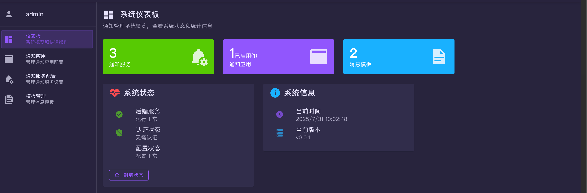
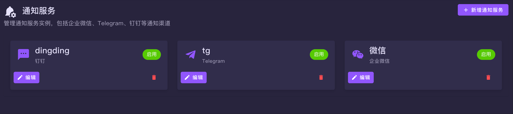
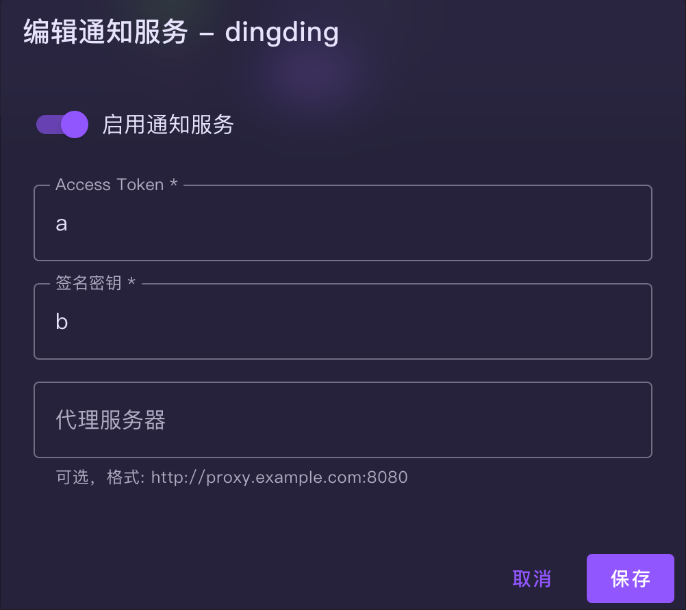
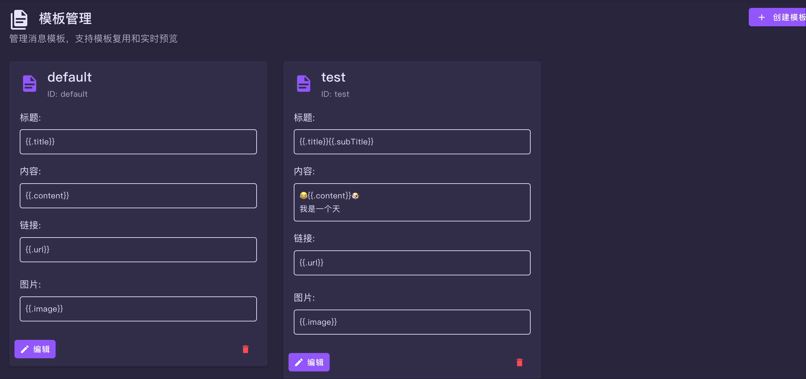
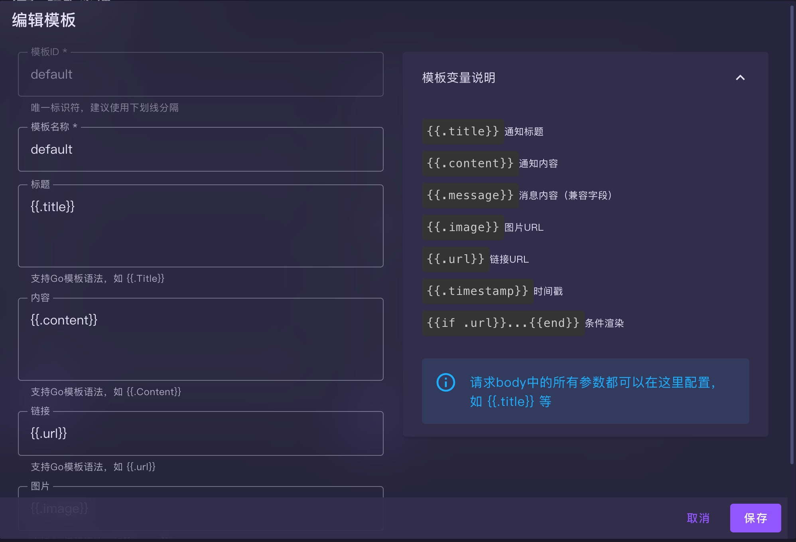
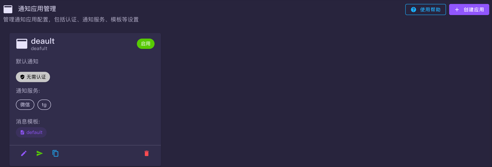
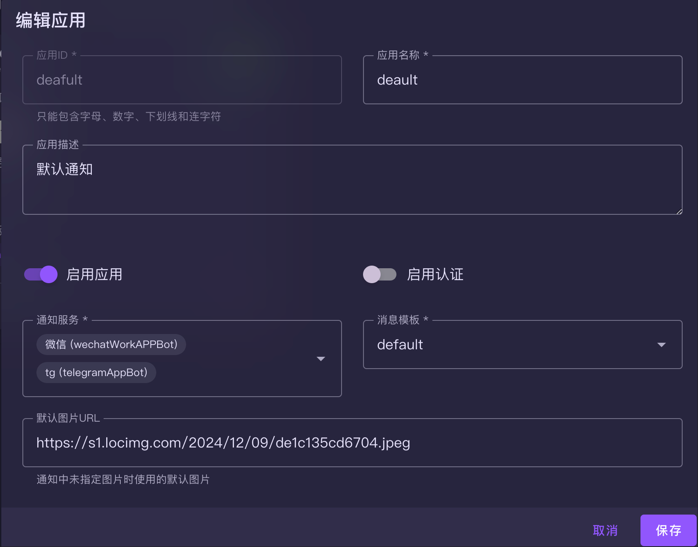

# Notify - 统一通知服务平台

[](https://opensource.org/licenses/MIT)
[](https://github.com/jianxcao/notify/stargazers)
[](https://github.com/jianxcao/notify/network/members)
[](https://github.com/jianxcao/notify/issues)
[](https://hub.docker.com/r/jianxcao/notify)
<!-- [](https://github.com/jianxcao/notify/releases) -->
[](https://golang.org/)
[](https://vuejs.org/)
[](https://github.com/jianxcao/notify/pulls)

一个功能强大、易于扩展的统一通知服务平台，支持多种通知渠道，提供灵活的消息模板和应用管理功能。


## ✨ 功能特性

### 🚀 多渠道通知支持
- **企业微信（WeChat Work）** - 支持多应用配置
- **钉钉（DingTalk）** - 支持群聊机器人, 信息内容支持markdown语法
- **Telegram** - tg机器人消息消息

### 📝 灵活的消息模板系统
- 支持 Go Template 语法
- 支持模板自定义字段组合

### 🎯 多应用管理
- 支持多个独立的通知应用
- 每个应用可配置不同的通知渠道和模板
- 支持应用级别的认证控制

### 🔒 安全认证
- 支持应用级别的 Token 认证
- 管理界面 Basic Auth 保护
- 灵活的认证策略配置

> 🛡️ **安全提醒**  
> 1. **修改默认密码**：首次部署后请立即修改默认的管理员账号密码（admin/password123）  
> 2. **使用强密码**：设置复杂的密码，包含大小写字母、数字和特殊字符  
> 3. **启用认证**：为所有通知应用配置安全的 Token 认证，避免未授权访问  
> 4. **网络安全**：生产环境中建议使用 HTTPS 并限制访问IP范围  
> 5. **定期更新**：定期更新系统和依赖包，关注安全公告  
> 6. **备份配置**：定期备份配置文件，避免数据丢失  

> 🛡️ **重要声明** 

> 1. 本项目仅供学习和个人使用
> 2. 请勿将部署的实例用于商业用途或公开服务
> 3. 如因公开分享导致的任何法律问题，用户需自行承担责任
> 4. 项目开发者不对用户的使用行为承担任何法律责任

### 🎨 现代化 Web 管理界面
- **基于 Vue 3 + Vuetify** 的响应式界面
- **可视化配置管理** - 无需手写 YAML 文件
- **通知器配置** - 支持企业微信、钉钉、Telegram 渠道的图形化配置
- **消息模板管理** - 所见即所得的模板编辑器
- **应用配置管理** - 选择通知服务和模板
- **实时通知测试** - 一键测试配置是否正确
- **表单验证** - 智能检查配置项的有效性

### 🐳 容器化部署
- 提供 Docker 镜像：`jianxcao/notify:latest`
- 支持 Docker Run 和 Docker Compose 部署
- 健康检查和自动重启

## 🏗️ 系统架构

```
┌─────────────────┐    ┌─────────────────┐    ┌─────────────────┐
│   Web 管理界面   │    │   HTTP API      │    │   通知渠道       │
│   Vue 3 + TS    │───▶│   Go + Gin      │───▶│   企业微信       │
│   Vuetify UI    │    │   REST API      │    │   钉钉          │
└─────────────────┘    └─────────────────┘    │   Telegram      │
                                              └─────────────────┘
                              │
                              ▼
                       ┌─────────────────┐
                       │   配置管理       │
                       │   YAML Config   │
                       │   热重载        │
                       └─────────────────┘
```

## 🚀 快速开始

### 使用 Docker Run

使用预构建的 Docker 镜像快速启动：

```bash
# 创建配置目录
mkdir -p ./config

# 启动服务（使用默认配置）
docker run -d \
  --name notify \
  -p 8088:8088 \
  -v $(pwd)/config:/config \
  -e NOTIFY_USERNAME=admin \
  -e NOTIFY_PASSWORD=password123 \
  -e CONFIG_FILE=/config/config.yaml \
  -e LOG_LEVEL=info \
  jianxcao/notify:latest
```

**访问服务**：
- 管理界面：http://localhost:8088
- 默认账号：admin / password123

### 使用 Docker Compose（推荐）

1. **创建 docker-compose.yml 文件**：
```yaml
services:
  notify-app:
    image: jianxcao/notify:latest
    container_name: notify-app
    ports:
      - "8088:8088"
    volumes:
      - ./config:/config
    environment:
      - TZ=Asia/Shanghai
      - NOTIFY_USERNAME=admin
      - NOTIFY_PASSWORD=password123
      - CONFIG_FILE=/config/config.yaml
      - LOG_LEVEL=info
      - LOG_FORMAT=text
    restart: unless-stopped
    healthcheck:
      test: ["CMD", "wget", "--no-verbose", "--tries=1", "--spider", "http://localhost:6666/api/v1/health"]
      interval: 30s
      timeout: 10s
      retries: 3
      start_period: 40s
```

2. **启动服务**：
```bash
# 创建配置目录
mkdir -p ./config

# 启动服务
docker-compose up -d
```

3. **访问管理界面进行配置**：
- 访问：http://localhost:8088
- 默认账号：admin / password123
- 🎯 **重要**：您可以完全通过 Web 界面配置所有设置，无需手动编辑 YAML 文件

### 手动部署

#### 后端服务

1. **环境要求**
- Go 1.21+
- 依赖管理：Go Modules

2. **运行步骤**
```bash
cd backend
go mod download
go build -o notify cmd/notify/main.go
./notify -config config/config.yaml
```

#### 前端界面

1. **环境要求**
- Node.js 18+
- pnpm

2. **运行步骤**
```bash
cd frontend
pnpm install
pnpm run build
# 将 dist 目录部署到 Web 服务器
```

## 🎨 界面预览

### 仪表板
系统提供了直观的仪表板界面，展示系统运行状态和各项配置概览：



### 通知服务管理
支持多种通知渠道的统一管理，包括企业微信、钉钉、Telegram等：





### 模板管理
提供可视化的消息模板编辑器，支持Go Template语法：





### 通知应用管理
支持多应用管理，每个应用可配置独立的通知渠道和模板：





## 📖 使用指南

### 📋 Web 界面配置（推荐）

启动服务后，访问 Web 管理界面进行可视化配置：

1. **访问管理界面**
   - 地址：http://localhost:8088
   - 默认账号：admin / password123

2. **配置通知渠道**
   - 进入「通知服务」页面
   - 点击「新增通知服务」
   - 选择通知类型（企业微信/钉钉/Telegram）
   - 填写相应的配置信息：
     - **企业微信**：企业ID、应用ID、应用密钥
     - **钉钉**：Access Token、签名密钥  
     - **Telegram**：Bot Token、Chat ID

3. **创建消息模板**
   - 进入「模板管理」页面
   - 点击「创建模板」
   - 设置模板名称和内容格式
   - 支持 Go Template 语法

4. **创建通知应用**
   - 进入「通知应用管理」页面
   - 点击「创建应用」
   - 配置应用信息：
     - 应用ID和名称
     - 选择使用的通知服务
     - 选择消息模板
     - 设置认证Token（可选）

5. **测试通知**
   - 在应用列表中点击「测试通知」
   - 验证配置是否正确

### ⚙️ 手动配置（可选）

如果需要批量配置或脚本化部署，也可以直接编辑 `config/config.yaml` 文件：

```yaml
notifiers:
  # 企业微信配置
  wechat_alerts:
    type: "wechatWorkAPPBot"
    enabled: true
    corp_id: "your_corp_id"
    agent_id: "1000001"
    secret: "your_secret"
  
  # 钉钉配置
  dingtalk_notifications:
    type: "dingTalkAppBot"
    enabled: true
    access_token: "your_access_token"
    secret: "your_secret"
  
  # Telegram 配置
  telegram_channel:
    type: "telegramAppBot"
    enabled: true
    bot_token: "your_bot_token"
    chat_id: "-1001234567890"

notification_apps:
  system_alerts:
    app_id: "system_alerts"
    name: "系统告警"
    description: "生产环境系统告警"
    enabled: true
    notifiers:
      - "wechat_alerts"
      - "telegram_channel"
    template_id: "system_alert"
    auth:
      enabled: true
      token: "your_secure_token"
templates:
    default:
        id: default
        name: default
        title: '{{.title}}'
        content: '{{.content}}'
        image: '{{.image}}'
        url: '{{.url}}'
    test:
        id: test
        name: test
        title: '{{.title}}{{.subTitle}}'
        content: "\U0001F602{{.content}}\U0001F436\n开心"
        image: '{{.image}}'
        url: '{{.url}}'      
```

> 💡 **提示**：推荐使用 Web 界面进行配置，更加直观且支持实时验证。手动编辑配置文件后需要重启服务。

### 发送通知

#### 使用 HTTP API

```bash
# 发送通知（需要认证）
curl -X POST "http://localhost:8088/api/v1/notify/system_alerts" \
  -H "Authorization: Bearer your_secure_token" \
  -H "Content-Type: application/json" \
  -d '{
    "title": "系统告警",
    "content": "CPU 使用率过高",
    "level": "critical"
  }'

# 使用 GET 方式（支持字段映射）
curl "http://localhost:8088/api/v1/notify/system_alerts?title=告警&content=磁盘空间不足&level=warning"
```


### 消息模板

支持 Go Template 语法的灵活模板，每个模板包含标题、内容、图片和链接等字段：

```yaml
templates:
  system_alert:
    id: "system_alert"
    name: "系统告警模板"
    title: "🚨 {{.level | upper}} 系统告警"
    content: |
      时间: {{.timestamp}}
      服务: {{.service}}
      消息: {{.content}}
      详情: {{.message}}
    image: ""
    url: "{{.url}}"
```

**模板字段说明**：
- `id`: 模板唯一标识
- `name`: 模板名称
- `title`: 消息标题模板
- `content`: 消息内容模板  
- `image`: 图片链接模板（可选）
- `url`: 跳转链接模板（可选）

**可用变量**：
- 标准字段：`{{.title}}`、`{{.content}}`、`{{.timestamp}}`
- 自定义字段：通过请求参数传入的任意字段，这些字段皆可以在模板中配置

#### EMBY播放消息模板

``` yaml
{
  "version": "1.0",
  "exportTime": "2025-07-31T13:47:13.450Z",
  "exportType": "single",
  "templates": [
    {
      "id": "emby_status",
      "name": "emby播放通知",
      "title": "{{.Title}}",
      "content": "{{- if and .Event (hasPrefix .Event \"playback\") -}}\n📅 时间: {{ .Description }}\n👤 用户: {{ .User.Name }}\n📱 设备: {{ .Session.DeviceName }} ({{ .Session.Client }})\n{{- if and .Item.RunTimeTicks .PlaybackInfo.PositionTicks }}\n⏱️ 播放进度: {{ printf \"%.1f%%\" (mul (div .PlaybackInfo.PositionTicks .Item.RunTimeTicks) 100) }}\n{{- end }}\n🎬 剧集标题: {{ .Item.Name }}\n📺 剧集: {{ .Item.SeriesName }} - {{ .Item.SeasonName }}\n🎯 类型: {{ .Item.MediaType }}\n🗓️ 年份: {{ .Item.ProductionYear }}\n{{- end }}",
      "image": "{{- if .Event -}} {{- if and .Event (hasPrefix .Event \"playback\") -}} {{- if .Item.ImageTags -}} {{- if .Item.ImageTags.Primary -}} {{ printf \"你的公网emby地址/emby/Items/%s/Images/Primary?tag=%s&quality=90\" .Item.Id .Item.ImageTags.Primary }} {{- end -}} {{- end -}} {{- end -}} {{- end }}",
      "url": "{{.url}}",
      "targets": "{{.targets}}"
    }
  ]
}

```

> 说明，emby 播放进度必须有公网地址才可以出现播放的图片，要不然只能用固定图片显示
> 在模板配置中直接导入即可使用
## 🔧 API 文档

### 通知接口

- **POST** `/api/v1/notify/{app_id}` - 发送通知（JSON 格式）
- **GET** `/api/v1/notify/{app_id}` - 发送通知（URL 参数）

### 管理接口

- **GET** `/api/v1/health` - 健康检查
- **GET** `/api/v1/admin/config` - 获取配置（需要认证）
- **POST** `/api/v1/admin/config` - 更新配置（需要认证）
- **POST** `/api/v1/admin/test` - 测试通知（需要认证）

## 🛠️ 开发指南

### 项目结构

```
notify/
├── backend/                 # Go 后端服务
│   ├── cmd/notify/         # 应用入口
│   ├── internal/           # 内部包
│   │   ├── app/           # 应用逻辑
│   │   ├── config/        # 配置管理
│   │   ├── notifier/      # 通知器实现
│   │   └── server/        # HTTP 服务器
│   └── config/            # 配置文件
├── frontend/               # Vue 前端界面
│   └── src/
│       ├── components/    # 组件
│       ├── pages/         # 页面
│       └── store/         # 状态管理
└── docker-compose.yml     # Docker 部署
```

### 扩展新的通知渠道

1. 实现 `notifier.Notifier` 接口
2. 在 `app.InitNotifiers()` 中注册
3. 添加配置结构和解析逻辑
4. 在前端添加对应的配置组件

### 环境变量

| 变量名 | 描述 | 默认值 |
|--------|------|--------|
| `NOTIFY_USERNAME` | 管理界面用户名 | - |
| `NOTIFY_PASSWORD` | 管理界面密码 | - |
| `LOG_LEVEL` | 日志级别 (debug/info/warn/error) | `info` |
| `LOG_FORMAT` | 日志格式 (text/json) | `text` |
| `CONFIG_FILE` | 配置文件路径 | `config/config.yaml` |
| `PORT` | 服务监听端口 | `:8088` |


<!-- ### ☕ 支持项目

如果这个项目对您有帮助，可以请我们喝杯咖啡 ☕

[](https://www.buymeacoffee.com/jianxcao)
[](https://github.com/sponsors/jianxcao) -->

## 🌟 项目统计


## 📝 许可证

本项目采用 [MIT 许可证](LICENSE) 开源，您可以自由使用、修改和分发。

---

<div align="center">

**🌟 如果这个项目对您有帮助，请给它一个Star！🌟**

Made with ❤️ by [Your Name](https://github.com/jianxcao)

</div>
