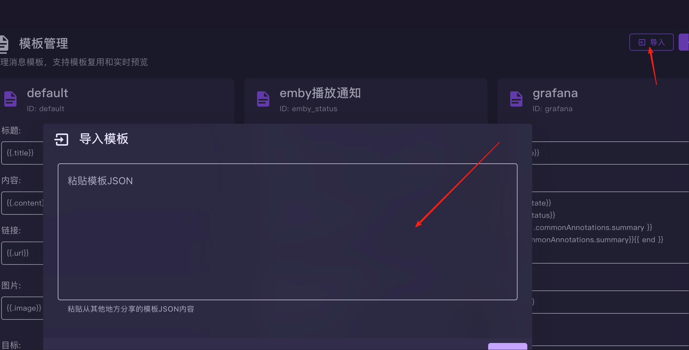
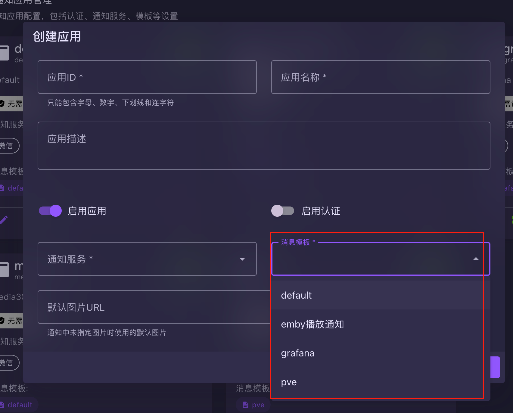
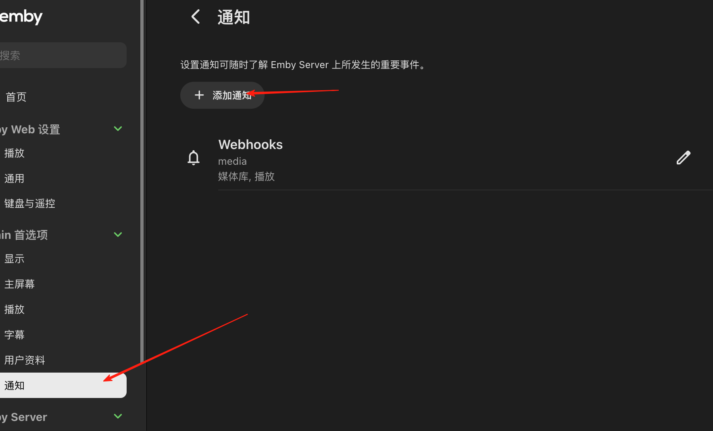
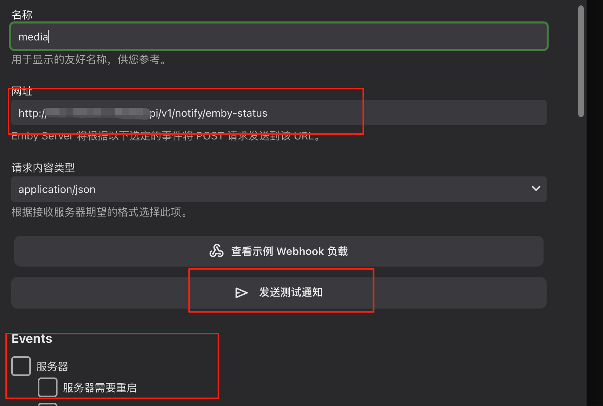

# emby通知配置说明

##  先建立模版

``` yaml
{
  "version": "1.0",
  "exportTime": "2025-08-02T07:31:35.234Z",
  "exportType": "single",
  "templates": [
    {
      "id": "emby_status",
      "name": "emby播放通知",
      "title": "\n{{- if .User.Name -}}{{.User.Name}} {{end -}}\n{{- if eq .Event \"playback.start\" -}}\n开始播放 \n{{- else if eq .Event \"playback.stop\" -}}\n停止播放 \n{{- else if eq .Event \"playback.unpause\" -}}\n停止播放 \n{{- else if eq .Event \"playback.pause\" -}}\n停止播放 \n{{- else if eq .Event \"library.new\" -}}\n新增媒体  \n{{- else if eq .Event \"library.updated\" -}}\n更新媒体 \n{{- else if eq .Event \"library.deleted\" -}}\n删除媒体 \n{{- else if eq .Event \"system.notificationtest\" -}}\n测试媒体 \n{{- else -}}\n{{ .Title }}\n{{- end -}}\n{{- if eq .Item.Type \"Episode\" -}}\n📺 {{ .Item.SeriesName }} - {{ .Item.SeasonName }} - {{ .Item.Name }}\n{{- else if eq .Item.Type \"Series\" -}}\n🎬 {{ .Item.Name }}\n{{- else if eq .Item.Type \"Movie\" -}}\n🎬 {{ .Item.Name }}\n{{- end }}",
      "content": "{{- if and .Event (or (hasPrefix .Event \"playback\") (hasPrefix .Event \"library\")) -}}\n📅 时间: {{ formatTime .Date \"2006-01-02 15:04:05\" }}\n{{- if and .User.Name }}\n👤 用户: {{ .User.Name }}\n{{- end }}\n{{- if and .Session.DeviceName .Session.Client }}\n📱 设备: {{ .Session.DeviceName }} ({{ .Session.Client }})\n{{- else if and .Session.DeviceName }}\n📱 设备: {{ .Session.DeviceName }}\n{{- end }}\n{{- if and .Session.RemoteEndPoint }}\n🌐 IP: {{ .Session.RemoteEndPoint }}\n{{- end }}\n{{- if and .Item.RunTimeTicks .PlaybackInfo.PositionTicks }}\n⏱️ 播放进度: {{ printf \"%.1f%%\" (mul (div .PlaybackInfo.PositionTicks .Item.RunTimeTicks) 100) }}\n{{- end }}\n{{- if or (eq .Item.Type \"Episode\") (eq .Item.Type \"Series\") }}\n📺 剧集: {{ .Item.SeriesName }} - {{ .Item.SeasonName }} - {{ .Item.Name }}\n{{- else if eq .Item.Type \"Movie\" }}\n📺 剧集: {{ .Item.Name }}\n{{- else if eq .Item.Type \"Movie\" }}\n🎬 电影: {{ .Item.Name }}\n{{- end }}\n🎯 类型: {{ .Item.Type }}\n🗓️ 年份: {{ .Item.ProductionYear }}\n{{- end }}",
      "image": "{{- if and .Event (or (hasPrefix .Event \"playback\") (hasPrefix .Event \"library\")) -}}\n{{- $id := .Item.Id -}}\n{{- if and .Item.BackdropImageTags (gt (len .Item.BackdropImageTags) 0) -}}\n{{ range $index, $element := .Item.BackdropImageTags }}\n{{ if eq $index 0 }}\n{{ printf \"https://你的emby/emby/Items/%s/Images/Backdrop/0?tag=%v&quality=90\" $id $element }}\n{{ end }}\n{{- end -}}\n{{- else if and .Item.ImageTags .Item.ImageTags.Primary -}}\n{{ printf \"https://你的emby/emby/Items/%s/Images/Primary?tag=%s&quality=90\" $id .Item.ImageTags.Primary }}\n{{- end -}}\n{{- end -}}",
      "url": "{{.url}}",
      "targets": "{{.targets}}"
    }
  ]
}

```

> 将上面的模版 导入到 模版里面



## 创建通知应用

> **此处注意要选择刚才创建的emby的模版**




## 配置emby的 webhook
> 打开 emby的webhhok




## 配置emby的 webhook





1. 此处配置 webhhook 地址可以从刚才配置的应用中复制
2. 最下面配置你想通知的时间
3. 可以点击中间的 **发送测试通知按钮**进行通知测试


> 说明，emby 播放进度必须有公网地址才可以出现播放的图片，要不然只能用固定图片显示