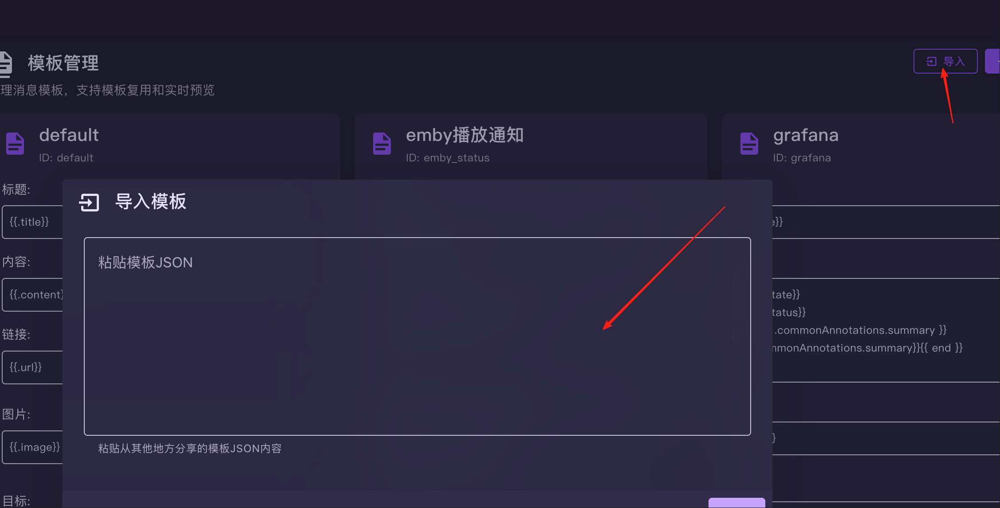

# PVE通知配置说明

##  先建立模版

``` yaml
{
  "version": "1.0",
  "exportTime": "2025-08-05T03:15:19.578Z",
  "exportType": "single",
  "templates": [
    {
      "id": "pve",
      "name": "pve",
      "title": "{{.title}}",
      "content": "{{- if .fields.hostname }}🖥️ 主机: {{.fields.hostname}}{{end}}\n{{- if eq .severity \"info\"}}\n🔵 {{.severity}} (信息)\n{{- else if eq .severity \"notice\" -}}\n🟡 {{.severity}} (通知)\n{{- else if eq .severity \"warning\" -}}\n🟠 {{.severity}} (警告)\n{{- else if eq .severity \"error\" -}}\n🔴 {{.severity}} (错误)\n{{- else if eq .severity \"unknown\" -}}\n⚪ {{.severity}} (未知)\n{{- else if .severity -}}\n⚫ {{.severity}} (其他)\n{{- end}}\n{{- if .fields.type }}\n{{- if eq .fields.type \"vzdump\"}}\n✅ 备份成功\n{{- else if eq .fields.type \"vzdump-fail\" -}}\n❌ 备份失败\n{{- else if eq .fields.type \"system-mail\" -}}\n✉️ 系统邮件\n{{- else if eq .fields.type \"package-updates\" -}}\n📦 可以更新软件包\n{{- else if eq .fields.type \"fencing\" -}}\n🛡️ 生成失败\n{{- else if eq .fields.type \"replication\" -}}\n🔁 复制失败\n{{- else -}}\n{{- end -}}\n{{- else }}\n{{.content}}\n{{- end -}}",
      "image": "{{.image}}",
      "url": "{{.url}}",
      "targets": "{{.targets}}"
    }
  ]
}

```

> 将上面的模版 导入到 模版里面





## 创建通知应用

> **此处注意要选择刚才创建的pve的模版**


## pve 配置
> 此处选择创建 pve 的通知


> 选择 webhhok


> 需要填 3 个字段


1. 请求地址，请从刚才创建应用位置直接复制接口

2. 标题即 header可以设置
  键： ```Content-Type``` 值: ```application/json```

3.正文即 body直接复制下面的即可

``` json
{
  "title": "{{title}}",
  "content": "{{ escape message }}",
  "severity": "{{ severity }}",
  "fields": {{json fields}},
  "timestamp": "{{timestamp}}"
}


```

## pve测试

> 此处选中你配置的通知，点击测试即可测试


## 最后开启通知
> 默认采用 email 通知，可以新建一个通知目标，配置成自己心增加的通知


